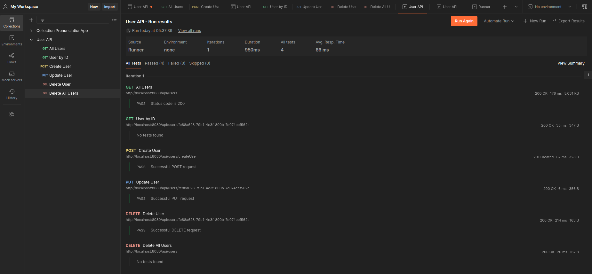

# PRA#02-SpringBoot: Create User API Rest

## CIFO La Violeta - FullStack IFCD0210-25 MF01

This document serves as a guide and log for the backend development of the PRA#02 Spring Boot project.

---

## PR Submission Checklist

### **Common Tasks:**

- [x] Create User @Entity
- [x] Create UserController (Rest API controller)
- [x] Implement UserRepository
- [x] Configure application properties with local H2 database
- [x] Develop UserService
- [x] Test all endpoints with Postman

### Optional Tasks:

- [ ] Configure Postgres database
- [ ] Implement Faker for test data
- [ ] Add unit tests for services
- [ ] Integration tests for controllers

### **Testing**:

- [x] All endpoints tested in Postman.
- [x] Error handling implemented in controllers.
- [x] Data persistence verified in H2 database.

---

## Estimated Time for Tasks

### Common Part

| Task                        | Estimated Time | Actual Time | Impediments (if any)                                                      | New Concepts                                                                                                 |
| --------------------------- | -------------- | ----------- | ------------------------------------------------------------------------- | ------------------------------------------------------------------------------------------------------------ |
| Create User @Entity         | 1 hours        | 45 min      |                                                                           | @PrePersist @GeneratedValue(strategy = GenerationType.UUID) @Column(unique = true, nullable = false) |
| Create UserController       | 1 hours        | 1.5 hour    |                                                                           | ResponseEntity utility methods   Centralize headers handling using helper method                         |
| Implement UserRepository    | 0.5 hours      | 0.5 hours   |                                                                           |                                                                                                              |
| Configure H2 database       | 0.5 hours      | 0.5 hours   |                                                                           |                                                                                                              |
| Develop UserService         | 2 hours        | 1 hours     |                                                                           |                                                                                                              |
| Test endpoints with Postman | 1.5 hours      | 2 hours     | data.sql only executes correctly if the table has been created previously | data.sql to introduce mock data  postman data file to test and run collections                           |

### Optional Part

| Task                              | Estimated Time | Actual Time | Impediments (if any) |
| --------------------------------- | -------------- | ----------- | -------------------- |
| Configure Postgres database       | 2.5 hours      | X hours     |                      |
| Implement Faker for test data     | 1 hours        | X hours     |                      |
| Add unit tests for services       | 2 hours        | X hours     |                      |
| Integration tests for controllers | 2 hours        | X hours     |                      |
| **Total**                         | **7.5 hours**  | **X hours** |                      |

---

## Images

#### Postman Runner Results

---

## Future Improvements

- Implement Global Exception Handling.
- Add more unit and integration tests for key functionalities.
- Implement custom queries for enhanced user search.
- Optimize service layer for better performance and maintainability.
- Enhance validation for user input fields.

---
