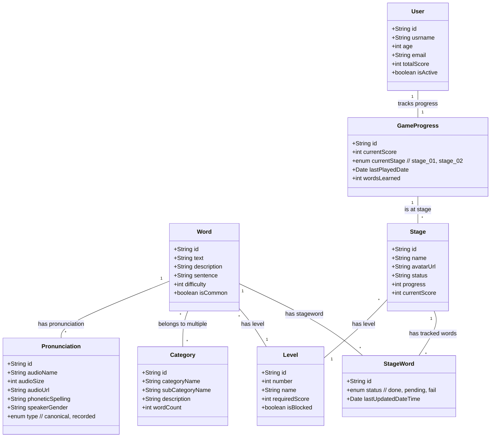

# PRA#04-SpringBoot: JPA Relationships and Model Enhancement

## Overview

This document serves as a guide and log for the frontend development of the PRA#04-SpringBoot project. The exercise focuses on implementing JPA relationships and enhancing the data model for a Spring Boot pronunciation application.

---

## UML Model



## PR Submission Checklist

### **Completed Tasks**:

- [x]  Review and Improve Model v0.2
- [ ]  Implement One-to-One: UserApp and GameProgress  
- [ ]  Create Many-to-Many: Word and Category
- [ ]  Implement One-to-Many/Many-to-One Relationships
- [ ]  Configure JPA Annotations
- [ ]  Create Repository Interfaces
- [ ]  Implement Basic Service Methods
- [ ]  Test Relationships
- [ ]  Data Auditing
- [ ]  Advanced Validation
- [ ]  Pagination and Sorting Support
- [ ]  Custom Query Optimization

### **Testing**:

- [ ] Relationship integrity tests
- [ ] Cascade operation tests
- [ ] Fetch strategy validation

---

## Estimated Time for Tasks

### Common Part

| Task                                   | Estimated Time | Actual Time | Impediments | New Concepts             |
| -------------------------------------- | -------------- | ----------- | ----------- | ------------------------ |
| Model Review                           | 15 min         | 10 min      |             | JPA mapping              |
| One-to-One (User-App and GameProgress) | 15 min         |             |             | Bidirectional mapping    |
| Many-to-Many (Word - Category)         | 15 min         |             |             | Join Table configuration |
| One-to-Many & Many-to-One              | 1:30 hours     |             |             |                          |
| Relationship Configuration             | 1 hour         |             |             | Cascade types            |
| Repository Creation                    | 10 min         |             |             | Spring Data JPA          |
| Service Implementation                 | 1 hour         |             |             | Service layer patterns   |
| Testing                                | 2 hours        |             |             | Data integrity checks    |
| **Total**                              | **6:30 hours** |             |             |                          |

### Optional Part

| Task                   | Estimated Time | Actual Time | Impediments | New Concepts        |
| ---------------------- | -------------- | ----------- | ----------- | ------------------- |
| Data Auditing          | 1 hours        |             |             | JPA Auditing        |
| Advanced Validation    | 1:20 hours     |             |             | Bean Validation     |
| Pagination and sorting | 2 hours        |             |             | Pageable interface  |
| Custom Queries         | 1 hour         |             |             | JPQL/Native queries |
| **Total**              | **5:20 hours** |             |             |                     |

---

## Error Documentation and Solutions

### Error: `[ERROR_MESSAGE]`

**Corresponding Task:** [RELATED_TASK]

**Description:** [ERROR_DESCRIPTION]

**Error Trace:**

- **Component:** [COMPONENT_NAME]
- **File:** [FILE_NAME]
- **Line:** [ERROR_LINE]
- **Stack Trace:**
  - [ERROR_TRACE]

**Possible Causes:**

- [POTENTIAL_CAUSES]

**Solution:**

```jsx
// Fixed code or solution
```

**Explanation:** [EXPLANATION_OF_THE_SOLUTION]

---

## Future Improvements

- **Caching Mechanism** - Add Hibernate second-level cache configuration
