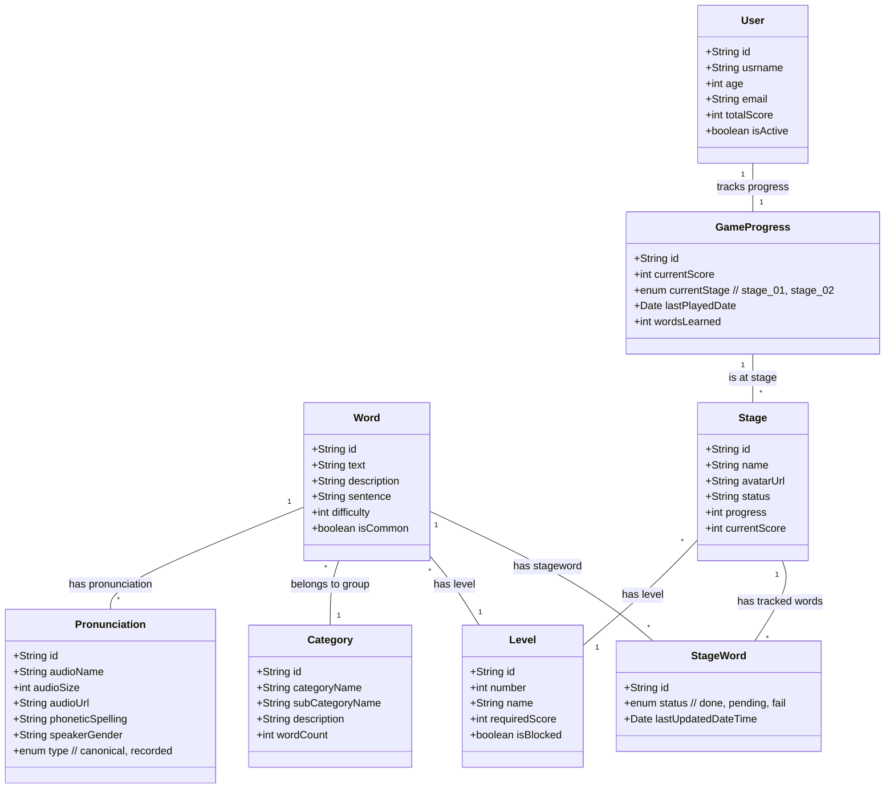

# pronunciationApp-v0.2-model-2.0

## Summary

The class diagram represents a <mark>gamified system for learning words</mark>, involving multiple users.

- The **User** class tracks individual profiles and progress through the **GameProgress** class, which monitors stages and scores. Words are central, belonging to categories (**Category**) and levels (**Level**), with associated pronunciations (**Pronunciation**).

- Users advance through **Stages**, which track progress and learned words using **StageWords**. Each stage is tied to a level, ensuring structured progression.

The system also incorporates metadata like word difficulty, phonetic spelling, and stage statuses for personalized learning.

---

### Note

The context assumes multiple users in a gamified learning environment where the **Word** class is <mark>the core entity driving the system.</mark>

