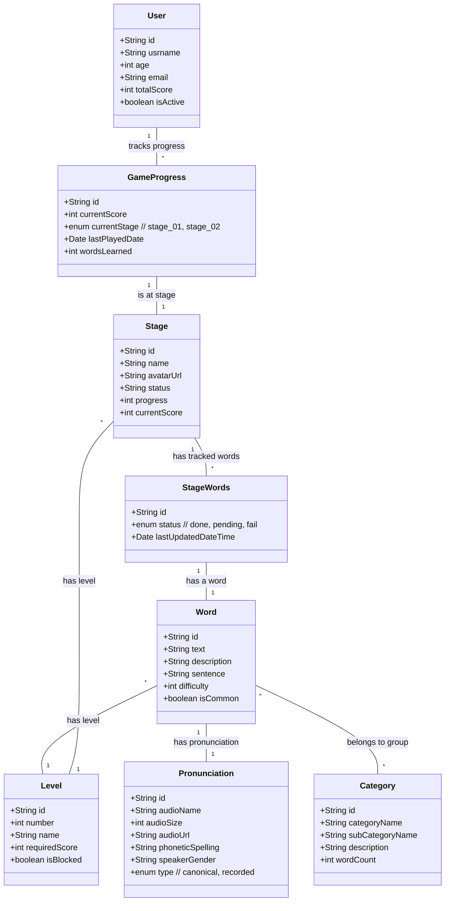

# pronunciationApp-v0.2-model

```mermaid
classDiagram
    class User {
        +String id
        +String usrname
        +int age
        +String email
        +int totalScore
        +boolean isActive
    }
    class Word {
        +String id
        +String text
        +String description
        +String sentence
        +int difficulty
        +boolean isCommon
    }
    class Pronunciation {
        +String id
        +String audioName
        +int audioSize
        +String audioUrl
        +String phoneticSpelling
        +String speakerGender
        +enum type  // canonical, recorded 
    }
    class Level {
        +String id
        +int number
        +String name
        +int requiredScore
        +boolean isBlocked
    }
    class Category {
        +String id
        +String categoryName
        +String subCategoryName
        +String description
        +int wordCount
    }
    class GameProgress {
        +String id
        +int currentScore
        +enum currentStage  // stage_01, stage_02 
        +Date lastPlayedDate
        +int wordsLearned
    }
    class Stage {
        +String id
        +String name
        +String avatarUrl
        +String status
        +int progress
        +int currentScore
    }
    class StageWords {
        +String id
        +enum status  // done, pending, fail 
        +Date lastUpdatedDateTime
    }


    User "1" -- "*" GameProgress : tracks progress
    Word "1" -- "1" Pronunciation : has pronunciation
    Word "*" -- "*" Category : belongs to group
    Word "*" -- "1" Level : has level
    GameProgress "1" -- "1" Stage : is at stage
    Stage "*" -- "1" Level : has level
    Stage "1" -- "*" StageWords : has tracked words
    StageWords "1" -- "1" Word : has a word  
```
